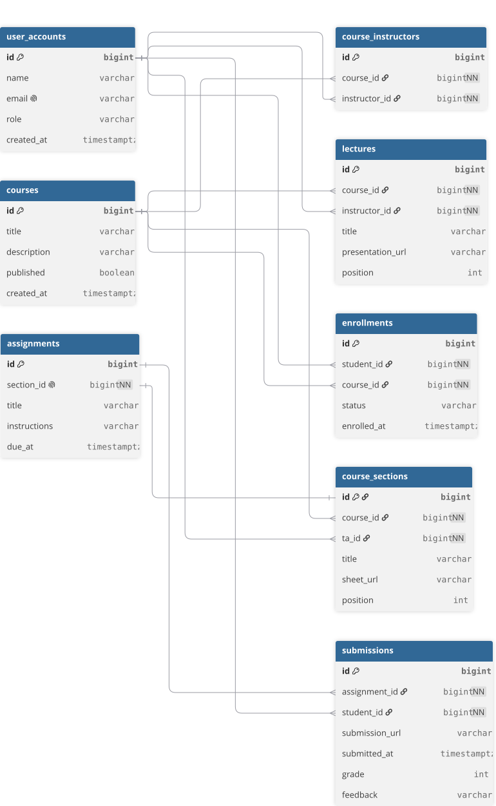

# LMS

A Spring Boot learning platform modeled on a university course: one or two professors teach lectures using
presentations; teaching assistants run sections using sheets and manage assignments; enrolled students submit their work
to the TA responsible for their section.

## System diagram



## Run locally

Create an empty PostgreSQL database named `lms`, then provide its connection settings through variables in
`application.properties`:

```bash
spring.datasource.url = ${DATABASE_URL}
spring.datasource.username = ${DATABASE_USERNAME}
spring.datasource.password = ${DATABASE_PASSWORD}
./mvnw spring-boot:run
```

Flyway creates the tables from `src/main/resources/db/migration`. Hibernate validates the resulting schema at startup.
The database itself must exist before the application starts; you do not need to create its tables manually. For local
settings, an optional untracked `secrets.properties` file is also supported.

## First workflow

Create professor, TA, and student accounts with `POST /api/users` (set `role` to `INSTRUCTOR`, `TEACHING_ASSISTANT`, or
`STUDENT`):

```json
{
  "name": "Samira Hassan",
  "email": "samira@example.test",
  "role": "INSTRUCTOR"
}
```

Create a course with one or two professor IDs using `POST /api/courses`:

```json
{
  "title": "Practical Java",
  "description": "A hands-on introduction to building Java applications.",
  "instructorIds": [
    1,
    2
  ]
}
```

Replace a professor with `PUT /api/courses/{courseId}/instructors`, sending `{"oldInstructorId":1,"newInstructorId":3}`.
In one transaction, the service updates the course's professor list and reassigns every lecture taught by the old
professor to the new one. This works for published courses too. The course keeps at most two professors; if the new
professor is already assigned, the old professor is simply removed from the team.

Replace a professor with `PUT /api/courses/{courseId}/instructors`, passing `{"oldInstructorId":1,"newInstructorId":3}`.
In one transaction, the service changes the course's professor list and reassigns every lecture taught by the old
professor to the new one. This also works for published courses. The course never has more than two professors; if the
new professor is already assigned, the old professor is simply removed from the team.

Add professor-taught lectures with `POST /api/courses/{courseId}/lectures`; each lecture names one of the course's
professors and includes a presentation URL. Add TA-led sections with `POST /api/courses/{courseId}/sections`; each
section names its TA and includes a sheet URL. Positions start at 1 and are unique within the course. Give every section
one assignment with `POST /api/sections/{sectionId}/assignment`.

Publish using `POST /api/courses/{courseId}/publish`; a course needs at least one lecture, one section, and an
assignment for every section. Courses use a boolean `published` field. Enroll a student with
`POST /api/enrollments?studentId={id}&courseId={id}`, then submit work with
`POST /api/assignments/{assignmentId}/submissions?studentId={id}` and a JSON body containing the URL of the student's
uploaded work. The submission is associated with the assignment, whose section identifies the TA responsible for it. The
TA-facing list is `GET /api/assignments/{assignmentId}/submissions`.

## Current API scope

An importable end-to-end Postman collection is available at `postman/LMS.postman_collection.json`. Import it, start the
application, then run the collection with its default `baseUrl` using the Collection Runner. Requests run in order and
save generated IDs automatically.
